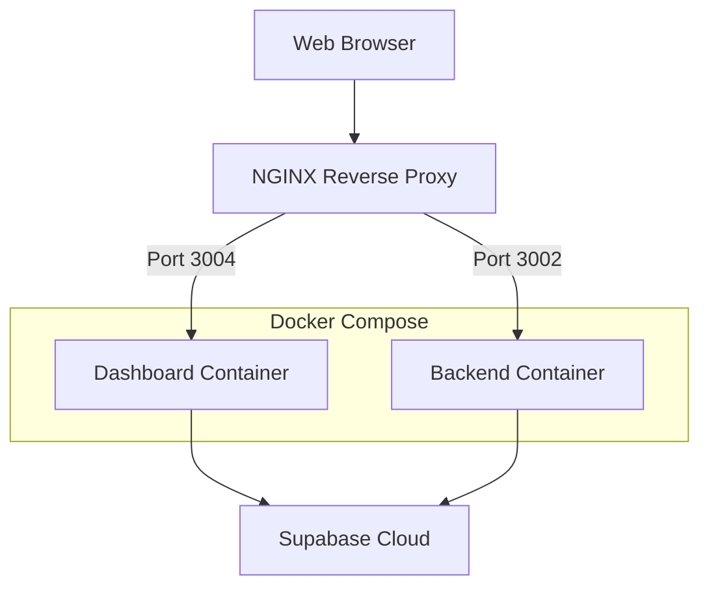

# ClassroomIO Deployment Plan

## Architecture Overview



## 1. Environment Setup

### Directory Structure
```bash
/opt/classroomio/
├── docker-compose.yml
├── nginx/
│   └── conf.d/
│       └── classroomio.conf
├── dashboard/
│   ├── .env
│   └── Dockerfile.prod
└── backend/
    ├── .env
    └── Dockerfile.prod
```

### Environment Variables

#### Dashboard (.env)
```env
PUBLIC_SUPABASE_URL=https://nowukrogullqfpvnnhzu.supabase.co
PUBLIC_SUPABASE_ANON_KEY=eyJhbGciOiJIUzI1NiIsInR5cCI6IkpXVCJ9...
PRIVATE_SUPABASE_SERVICE_ROLE=eyJhbGciOiJIUzI1NiIsInR5cCI6IkpXVCJ9...
IS_SELFHOSTED=true
DEPLOYMENT_PROVIDER=docker
PRIVATE_APP_HOST=class.pavelcherkashin.com
PRIVATE_APP_SUBDOMAINS=app
```

#### Backend (.env)
```env
PUBLIC_SUPABASE_URL=https://nowukrogullqfpvnnhzu.supabase.co
PUBLIC_SUPABASE_ANON_KEY=eyJhbGciOiJIUzI1NiIsInR5cCI6IkpXVCJ9...
```

## 2. Docker Configuration

### docker-compose.yml
```yaml
version: '3.8'

services:
  dashboard:
    build:
      context: .
      dockerfile: apps/dashboard/Dockerfile.prod
    ports:
      - "3004:3004"
    env_file:
      - ./apps/dashboard/.env
    restart: unless-stopped

  backend:
    build:
      context: .
      dockerfile: apps/backend/Dockerfile.prod
    ports:
      - "3002:3002"
    env_file:
      - ./apps/backend/.env
    restart: unless-stopped

networks:
  default:
    name: classroomio_network
```

## 3. NGINX Configuration

### /etc/nginx/conf.d/classroomio.conf
```nginx
server {
    listen 80;
    server_name class.pavelcherkashin.com;

    location / {
        proxy_pass http://localhost:3004;
        proxy_http_version 1.1;
        proxy_set_header Upgrade $http_upgrade;
        proxy_set_header Connection 'upgrade';
        proxy_set_header Host $host;
        proxy_cache_bypass $http_upgrade;
    }

    location /api {
        proxy_pass http://localhost:3002;
        proxy_http_version 1.1;
        proxy_set_header Upgrade $http_upgrade;
        proxy_set_header Connection 'upgrade';
        proxy_set_header Host $host;
        proxy_cache_bypass $http_upgrade;
    }
}
```

## 4. Deployment Steps

1. **Initial Setup**
   ```bash
   # Create project directory
   mkdir -p /opt/classroomio
   cd /opt/classroomio

   # Clone repository
   git clone https://github.com/classroomio/classroomio.git .
   ```

2. **Configure Environment**
   - Create .env files for dashboard and backend
   - Set up NGINX configuration

3. **Build and Start Services**
   ```bash
   # Build and start containers
   docker-compose up -d --build
   ```

4. **Verify Deployment**
   - Check container status: `docker-compose ps`
   - View logs: `docker-compose logs -f`
   - Test access: http://class.pavelcherkashin.com

## 5. Monitoring & Maintenance

### Container Management
```bash
# View container status
docker-compose ps

# View logs
docker-compose logs -f [service_name]

# Restart services
docker-compose restart

# Update deployment
git pull
docker-compose up -d --build
```

### Backup Procedures
1. Export Supabase data regularly (handled by Supabase Cloud)
2. Back up environment files
3. Back up NGINX configuration

### Health Checks
- Monitor container resource usage: `docker stats`
- Check NGINX access logs: `/var/log/nginx/access.log`
- Check NGINX error logs: `/var/log/nginx/error.log`

## 6. Troubleshooting

Common issues and solutions:
1. Container not starting: Check logs with `docker-compose logs`
2. NGINX 502 Bad Gateway: Verify container health and port accessibility
3. Connection issues: Check firewall rules and port configurations

## 7. Security Considerations

1. Keep environment variables secure
2. Regularly update Docker images
3. Monitor Supabase access logs
4. Implement rate limiting in NGINX if needed
5. Set up container resource limits

## Next Steps

1. Deploy using the provided instructions
2. Set up SSL/HTTPS configuration
3. Implement monitoring solution if needed
4. Set up automated backups if required